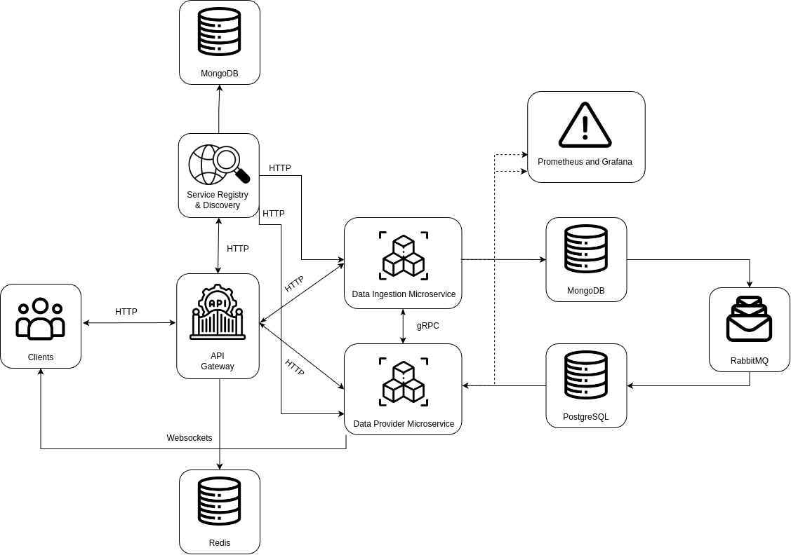

# Real-Time Stock Price Tracker
---
Real-Time Stock Price Tracker, code name `Lizards`, it is a platform where users can track stock prices in real-time. One microservice manages WebSocket connections to provide real-time updates, and the other microservice fetches stock data from external APIs. 

### Application Suitability
---
* Scalability
Real-time stock data requires high throughput, which can vary depending on the number of users and the volume of trades. 
Microservices allow individual services to scale independently based on demand.

* Separation of Concerns
Each component of the application, such as stock price fetching, user notifications, data caching, and analytics, 
can be handled by separate microservices. This isolation of functionality ensures better code maintainability and 
allows for independent development.

* Performance Optimization
Real-time systems demand low-latency responses, especially when handling fast-moving stock prices. 
Microservices enable you to use the best-suited technologies for each part of the application, like WebSockets for real-time 
communication, without affecting other components.

* Fault Isolation and Resilience
If a service that handles historical data fails, it won’t necessarily impact the real-time stock price stream, 
as each service operates independently. This leads to better fault tolerance and resilience in the system.

* Flexible Deployment
Services like data aggregation, notifications, and real-time updates can be deployed and updated independently, 
allowing for faster iteration and continuous integration without downtime for the entire system.

### Service Boundaries
---


* **Data Ingestion Microservice** -- gathering data about the stock prices from the web, or free APIs. 
* **Data Provider Microservice** -- creating a websocket connection with the client for quick updates.   

### Technology Stack 
---
#### Gateway
The following points will be the primary responsibility of the API Gateway:

* **Request Routing** - the routing will be done in pair with the Service Discovery;
* **Load Balancing** - balance the load across multiple instances of a microservice;
* **Rate Limiting** - limit the number of requests a client can make to prevent abuse; 
* **Caching** - store responses from microservices temporarily to reduce latency and improve performance for frequently requested data.

For this reason, Golang was chosen. The build-in libraries, with a great coroutine schedule that offers "cheap" green threads, is the best pick for this kind of tasks.

#### Service Registry & Discovery 
Following the same logic, and due to the constrains of the laboratory work, Golang is chosen, as the development language of it.

#### Microservices
Due to the vast number of available libraries, and the nature of the deployment, Python is chosen. For each microservice the following frameworks will be used:

* **Data Ingestion Microservice:** scrapy, pymongo, FastAPI, Playwright, grpcio, pika, prometheus_client, schema, py_test; 
* **Data Provider Microservice** FastAPI, websockets, SQLAlchemy, pika, prometheus_client. 

#### Databases
* **Redis** - used for caching in the API gateway;
* **MongoDB** - used for storing unstructured data about stock prices from web, i.e. a temporary storage;
* **PostgreSQL** - used for storing uniformly structured, validated data about stock prices.

### Data Management
---
#### Workflow
When a client runs the application a websocket connect is created to facilitate real-time data updates from the `Data Provider Microservice`. This microservice is taking data from the `PostgreSQL` database, where all the data is well structured. This database is read-only for the previously mentioned microservice. The updates in the databases will be performed by a worker from within the `Data Provider Microservice`. That worker will be the consumer of the `RabbitMQ` queue.  

The producer is the `Data Ingestion Microservice`. It consists primarly of the following parts:
1. **Ingestion** - a collection of scrapers or data miners are getting data from the web, about the current stocks prices;
2. **Storing** - all the found raw data will be stored in the `MongoDB`. 
3. **Transforming** - a step where the raw data from the web is converted based on a scheme and validated before being send back;
4. **Producing** - the transformed data is send via a worker to the queue, it being the producer of the queue. 

#### Contracts

**Service Registry & Discovery**

_Register a Service_
```json
path: /services/:service-id
method: POST
{
    name: "Service A",
    ip_address: "10.0.x.x",
    port_number: "8042",
    protocol: "TCP"
}
```
```json
200 OK - success
400 Bad Request - invalid payload
```

_Deregister a Service_
```json
path: /services/:service-id/:instance-id
method: DELETE
```
```json
204 No Content - sucess
```

_Fetch instance's list_
```json
path: /services/:service-id
method: GET
```
```json
status code: 200 OK
content-type: application/json

{
  service_name: "Service A",
  instance_count: 5,
  registered_at: "2031-10-10T12:11:42Z",
  instances: [
    {
      ip_address: "10.0.1.x",
      port_number: "8042"
    },
    {...}
  ]
}
```

**Data Ingestion Microservice** 

_Get list of sources_
```json
path: /sources
method: GET
```
```json
status code: 200 OK
content-type: application/json

{
    "sources": ["https://www.alphavantage.co/", ...]
}
```

**Data Provider Microservice**

_Create session_
```json
path: /session
method: POST

{
    "websocket_url": "ws://localhost:7890"
}
```
```json
200 OK - succes
```

* **Client side**

_Connection and Subcription_
```json
{
    "type": "subscribe",
    "symbols": ["AAPL", "TSLA"]
}
```

_Unsubscription_
```json
{
    "type": "unsubscribe",
    "symbols": ["AAPL"]
}
```

* **Server Side**

_Update client on stock prices_
```json
{
    "type": "price_update",
    "data": {
        "AAPL": {
        "price": 150.23,
        "timestamp": "2024-09-14T12:34:56Z"
        },
        "TSLA": {
            "price": 742.56,
            "timestamp": "2024-09-14T12:34:56Z"
        }
    }
}
```

_Notify user about error_
```json
{
    "type": "error",
    "message": "Invalid stock symbol: XYZ"
}
```

**Proto File**
```proto
syntax = "proto3";

package dataprocessor;

// The data processing service definition.
service DataProcessor {
  // Sends raw data to be processed
  rpc ProcessData (RawData) returns (ProcessingResponse);
}

// The raw data message format
message RawData {
  string content = 1;
}

// The processing response message format
message ProcessingResponse {
  string status = 1;
  string message = 2;
}
```
_Note:_ This is the initial version of the `.proto` file, it might change.

### Deployment
---

All the microservices, as well as the databases, and the message broker, will be containerized using `Docker`. For the microservices `Docker Compose` will be used to orchestrate their inner-dependencies. The Prometheus and Grafana stack will be deployed outside the project's core, acting as a third-party dependency. 